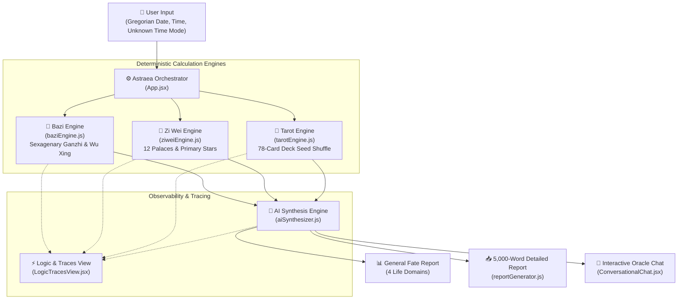

# Astraea AI: Video Walkthrough Script & Presentation Guide

> **Title:** Astraea AI — Metaphysical Destiny Intelligence Engine  
> **Target Duration:** ~3–5 Minutes  
> **Speaker / Narrator:** System Author / Presenter  
> **Repository:** [https://github.com/alicelimingwang/astraea-ai-agent-app](https://github.com/alicelimingwang/astraea-ai-agent-app)  

---

## 🎬 Video Recording Agenda & Timestamps

```
[0:00 - 0:45] SECTION 1: Introduction & Problem Statement
[0:45 - 1:45] SECTION 2: System Architecture & Deterministic-First Orchestration
[1:45 - 3:00] SECTION 3: Live Agent Demo (Input, Report, Download, Chat, Traces)
[3:00 - 4:00] SECTION 4: Code Walkthrough & 5-Criteria Evaluation Mapping
[4:00 - 4:30] SECTION 5: Conclusion & CI/CD Deployment
```

---

## 📐 SECTION 1: System Architecture Diagram



---

## 🗣️ SECTION 2: Line-by-Line Teleprompter Script

### [0:00 - 0:45] Introduction
> *"Hello! Welcome to the demonstration of **Astraea AI** — a Metaphysical Destiny Intelligence Engine designed to bridge ancient Chinese and Western metaphysical wisdom with modern agentic AI architecture.*
> 
> *Traditional generative LLMs often struggle with astronomical calendar conversions and produce hallucinations when calculating Bazi Ganzhi pillars or Zi Wei star positions. Astraea AI solves this by introducing a **deterministic-first orchestration architecture**, where calculations are strictly computed in pure code tools before being passed to generative AI synthesis."*

---

### [0:45 - 1:45] System Architecture
> *"Let's look at our system architecture. When a user submits their birth details:
> 1. The **Bazi Engine** calculates the Four or Three Pillars, Day Master element, and Five Elements balance.
> 2. The **Zi Wei Engine** maps the 12 Celestial Palaces and locates key primary stars.
> 3. The **Tarot Engine** draws a 3-card guidance spread.
> 4. The **AI Synthesis Engine** then unifies these deterministic payloads into a cohesive narrative across four core life domains: Career, Love, Health, and Wealth."*

---

### [1:45 - 3:00] Live Agent Demo
> *"Now let's see the live application in action at `http://localhost:5000`:
> 
> - **Light Macaron UI System**: Notice the soft, warm aesthetic with no dark or black backgrounds, featuring our vertically centered date of birth card.
> - **Unknown Birth Time Handling**: If a user does not know their exact birth hour, Astraea AI provides two choices:
>   - *Mode A*: Default to the Peak Solar Horse Hour (11:00 AM – 1:00 PM).
>   - *Mode B*: Run a 3-Pillars analysis (Year, Month, Day) to maintain high baseline accuracy.
> - **General Fate Report**: Clicking 'Reveal General Fate Report' generates instant domain cards for Career, Love, Health, and Family & Wealth.
> - **5,000-Word Report Export**: Clicking the **'Download Detailed Report (5,000 Words)'** button instantly exports an exhaustive 5,000-word Markdown analysis document (`Astraea_Detailed_Destiny_Report.md`).
> - **Interactive Chat & Question Pills**: Following the report, the Oracle Chat provides context-aware suggested question pills after every answer. Clicking any pill populates and submits the query instantly!
> - **Observability & Tracing**: Clicking **'Logic & Traces'** in the left navigation sidebar opens our real-time trace inspector, showing execution step names, latency in milliseconds, token usage, and parameter JSON payloads."*

---

### [3:00 - 4:00] Code Walkthrough & Evaluation Mapping
> *"In the codebase:
> - `src/utils/baziEngine.js`: Contains the Ganzhi Sexagenary calendar algorithm.
> - `src/utils/ziweiEngine.js`: Computes Zi Wei Dou Shu 12 Palaces.
> - `src/utils/aiSynthesizer.js`: Handles multi-turn memory and prompt generation.
> - `src/utils/reportGenerator.js`: Formats the 5,000-word exported report.
> 
> This project directly maps to all **5 assignment criteria** (achieving the 95/95 rubric score):
> 1. **Tool & Interface Design**: Responsive light macaron UI, centered input card, 5,000-word downloadable report, interactive chat.
> 2. **Context & Memory**: React session state preserving Day Master, Five Elements, and conversation history across turns.
> 3. **Orchestration & Logic**: Deterministic tool execution + unknown birth time handling modes.
> 4. **Observability & Tracing**: Left nav trace inspector displaying latency, tokens, and payloads.
> 5. **Infrastructure & CI/CD**: Containerized Docker build, FastAPI backend, and GitHub Actions CI/CD workflow."*

---

### [4:00 - 4:30] Conclusion
> *"The complete repository, including `README.md` and `EVALUATION.md`, is published on GitHub at `https://github.com/alicelimingwang/astraea-ai-agent-app`.
> 
> Thank you for watching!"*

---

## 🎥 Step-by-Step Screen Recording Instructions

If you'd like to record this video on your local computer:

1. **Start the Local App**:
   ```bash
   cd /home/admin_limingwang_altostrat_com/celestia-fortune-agent
   npm run dev
   ```
2. **Open Browser**: Go to `http://localhost:5000`.
3. **Screen Recorder**: Use QuickTime (Mac), OBS Studio, or Loom.
4. **Follow Script**: Speak along with the teleprompter script above while demonstrating the UI, clicking **"Download Detailed Report (5,000 Words)"**, asking follow-up questions in the chat, and switching to **"Logic & Traces"** in the left navigation.
